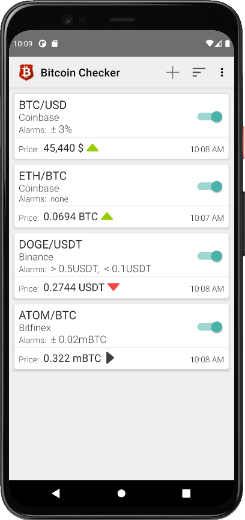

# Bitcoin Checker

> Notice: This project continues the development of the [previous inactive project Bitcoin Checker](https://github.com/mobnetic/BitcoinChecker).

## About
__Bitcoin Checker__ is a FREE app to track the most recent prices of your favourite currency pairs (on over 80 supported exchanges) in many customizable ways (such as rich notifications, TTS voice announcements, Home and Lockscreen widget or multiple alarms).

This Github project contains open [DataModule](dataModule) (containing exchanges and currency pairs) for Bitcoin Checker app. It is  _OPEN_ for our users to make this application _even better_! This means that _anyone_ can now:
* Add support for a new exchange
* Update currency pairs on their favourite exchange

See the [Development guide](docs/development.md) for contributing.

## Issues
Please submit all requests for new exchanges or bugs in Bitcoin Checker apps in the [Issues](../../issues/) section.

## Install
Bitcoin Checker app available on Google Play: https://play.google.com/store/apps/details?id=com.aneonex.bitcoinchecker

## Donate ⭐
If you like Bitcoin Checker, you can donate for the development and support of the application:
- BTC: 1ADwViiQWaiw5ghkcNnSRA5KDZhdhgGvR1
- ETH: 0x39F4C57F0136FB7F660c93E9d22c99E451627967

Thank you!
